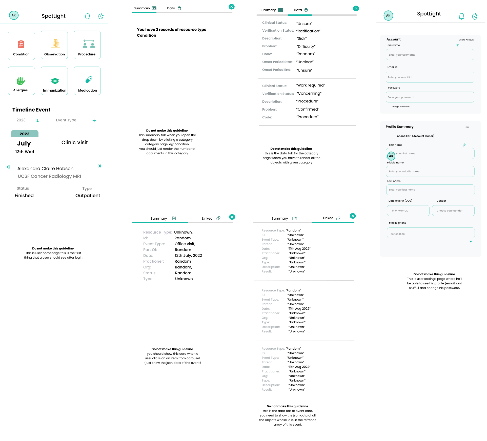

# Healthcare app

You are making a react/node web app for a patient, where they can create an account, and see their documents.

### Instructions:
- Use typescript , plain javascript is not allowed
- you're allowed to remove 

### Deliverables:
- you can fork this repo
- complete the assignment
- create a pull request with your completed assignment
- if you're using a database, or any other .env varialbes write them in readme so that we can test run your code.

### Design: 

## Frontend

`Note: Use Mantine, Tailwind or any similar UI library to make the frontend`

### Category
- Make six top level cards with title: Observation, Condition, Immunization, Procedure, Medication and Allergies, 
- When clicks on any card fetch the filtered array that has the following resourceType as the title of this card.
- Render the cards as Non-Timeline-Card
### Timeline
- Make a Carousel and render all timeline objects where the eventType is not “noEvent”
- Render Each object as a Timeline-Card 
- Add an option to filter the cards on eventType and year
- Add the expand button on bottom of the card and when a user clicks the card, render the Non-Timeline-Card component for each reference id in references (fetch the card data from this id)
### Pages:
- Add login and Signup component on Landing Page, 
- After the user logs in show him the user homepage
- Add a forgot password feature
- Make sure only a logged in user can see the user homepage and similarly only a logged out user can login again

## Backend

Your backend should be responsible for authenticating a user and providing the data to show in frontend via proper protected routes

- any data that you show in frontend should come from this backend, and you must not store any json file in frontend which you'll use to show any files
- make sure a user is not able to access any routes without an active user session.

### Routes

* `/auth/signup:` 
    - Signup should be a post request that takes username and password as input, hash the password and then store it in mongodb
    - DO NOT STORE PASSWORDS IN PLAIN TEXT
* `/auth/login`
    - Login is also going to be another post route and if the given password matches the hash password stored in database, create a session of the user with necessary info like his username and id 
* `/auth/logout`
    - After hitting logout route, destroy the session and clear the cookie in user’s browser
* `/auth/verify`
    - Verify is going to be a get route which the frontend would hit to make sure whether the user is authenticated or not, the frontend is going to serve the private pages only if this verify route gives a 200 status code and some user info like username and id for the frontend to show on header or something similar.

* `/api/user/profile`
   - This route should return the data you’re provided in the json file, it’s up to you whether you wanna read the json file and send it or store that json file in mongo make a mongoose schema and then serve it to frontend
   - But make sure that this route should not be accessible to a user who doesn’t have an active session.
* `/api/user/update`
    - make suitable routes for handling the user update data
### ErrorHandling
   - Make sure that hitting on any of the routes shouldn’t crash the web server
  -  Make sure to handle 409 errors if a user tries to signup with an existing name 
   - Make sure to handle 401 unauthorised errors if a user tries to login with the wrong password or access a private route without an active session.
 - Make sure to handle 422 errors if a user hits a post route without necessary information

### Validation:
 - Make sure that a route like signup should validate the body of request as it must have all the necessary fields
### Session:
 - You should use express-session package or anything similar to handle user login and validate it every time a user hits a private route. If you can use a database to store sessions it would be better.

 ### DataBase:
- Ideally you should use mongodb or any no-sql database for storing user credentials
- It is recommended to use mongoose ODM to handle mongodb queries for its schema validation.
- `Models`: Ideally you should have two models, 
    * `User`: User model for storing user credentials including username, email, passwords, (phone number if you want to ) and demographics (dob and gender)
    * `Timeline`: The timeline should have two keys  
        - userID: id of the user who owns this document
       - Data: the actual timeline data, (you’ll get this from the given json file)
### Types:
  - Try to keep codebase as strongly typed as possible and avoid using :any type wherever possible,
### Logging: 
   - Use a library like winston or anything similar to keep track of logs every time a user logs in or logs out and if the server throws an error.
   - Try to make a middleware that logs out these routes rather than calling the log function in the route controller itself.
### Test:
- It would be really great if you can write unit tests for your backend components, it’s completely optional, but if you can try using either of the testing libraries from mocha, jest and supertest.

Feel free to use eventEmitter or any special modules you find necessary.

